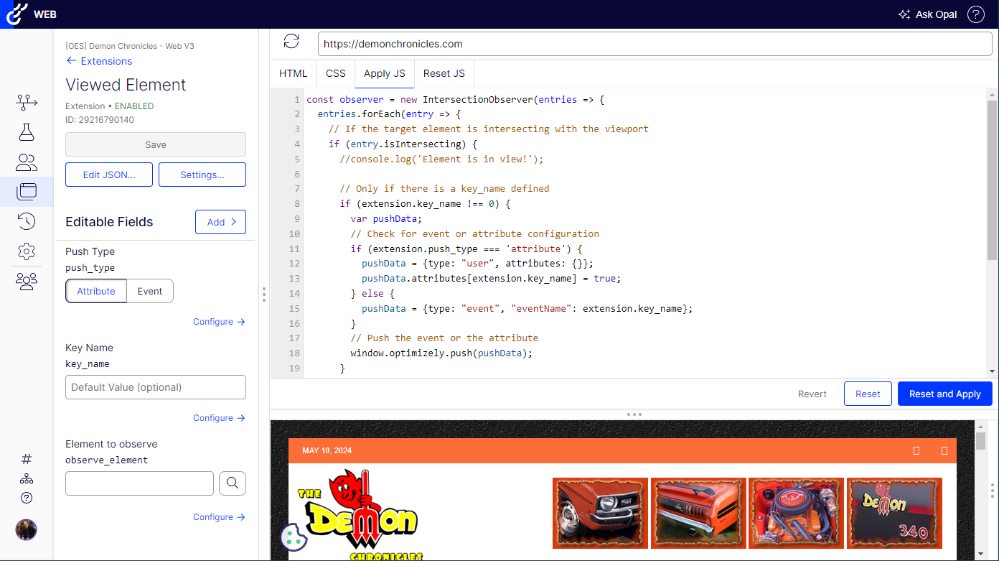

# Optimizely Web Experimentation - Extensions

A collection of extensions for Optimizely Web Experimentation.

  

This repository contains extensions for the following functionality:
* **Viewed Element** Extension to push an event or an attribute based on an element being seen in the browser viewport.