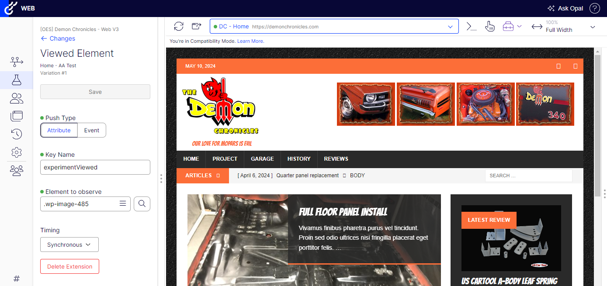

## Viewed Element

Extension to push an event or an attribute based on an element being seen in the browser viewport.

  

### To use

1. Navigate to **Implementation** and select the **Extensions** tab.
2. Click on **Create New Extension** and select **Using JSON**.
3. Paste the provided json into JSON Code box and click **Create Extension**.
4. Enable the newly created extension.